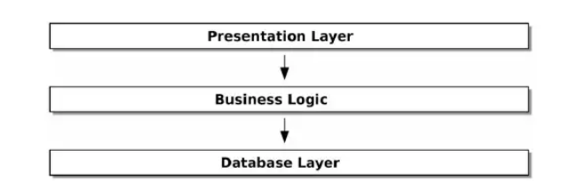

# Arquitectura de Capas

Debemos prestar atención a la interacción de nuestros objetos y funciones. Cuando una función u objeto utiliza otro, decimos que uno depende del otro. Estas dependencias forman una especie de red o grafico de nodos. Cambiar un nodo del gráfico se vuelve difícil por que tiene el potencial de afectar muchas otras partes del sistema. ***Las arquitecturas en capas son una forma de abordar este problema*** 

En arquitecturas de capas, dividimos nuestro código en categorías o roles discretos e introducimos reglas sobre que categorías del código se pueden llamar entre si.

Uno de los ejemplos mas comunes es la arquitectura de tres capas:

*Fuente: Patrones de Arquitectura de Software - Harry Percival*

En este modelo tenemos componentes como la **capa de presentación** (interfaz de usuario) que pueden ser:

- Pagina Web
- API
- Linea de comandos

En la **capa de lógica** de negocio tenemos las reglas comerciales y nuestros flujos de trabajo

Finalmente tenemos la **capa de base de datos** que es responsable de almacenar y recuperar datos.